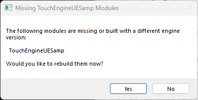

# FAQ

## I have placed the plugin in the plugin folder, but my project doesn’t start anymore.

Remember that you are now working in a game engine and that they are prerequisites to game development being applied. In most cases, you will need all the tools required for an Unreal project to compile, with specific versions.

The common issue is with missing dependencies for the project to compile. When starting your `.uproject`, you should see a popup dialog opening which should prompt you to recompile the project, or both the project and plugin. If it fails you can see part of the log or go find the log files in 

One of the popup dialog you might encounter, or something similar.

Unreal usually points which version and which tool you are missing. Those should includes (and are not limited to): Visual Studio Build Tools 2022, .Net Framework, .Net Core Runtime... etc.

The most common one that users might be missing are the Visual Studio Build Tools, available here: [https://visualstudio.microsoft.com/downloads/#build-tools-for-visual-studio-2022](https://visualstudio.microsoft.com/downloads/#build-tools-for-visual-studio-2022)

If you proceed but it fails, you can have a look at the log. It is likely that the cause of the error will be mentioned and a quick search on your favorite search engine should give you clues. You should find the logs in your project folder `./Saved/Logs`. If they are not here, you might find them in your user `AppData/Local/UnrealBuildTool` directory.

## I package a project making use of the TouchEngine Plugin but none of my .tox assets come with it.

You need to add the tox files folder to the "Additional Non-Asset Directories" the project settings. The sample project has it added already.

## Packaging is slow or fails, sometimes with a "TouchEngineVulkanRHI" error.

⚠️⚠️⚠️ **Pure BP projects** (projects that don't have any C++ classes, or non packaged plugins) require users to manually add the key `"EnabledByDefault": false` to the `Project Folder/Plugins/TouchEngine/TouchEngine.uplugin` file when packaging a project. Otherwise, you might get a message stating that a module related to TouchEngine is missing. This is an issue on Unreal packaging end and not something that we can solve at the moment.

Before packaging, review the Windows targeted RHIs / shader formats settings and disable the ones you do not need:
- Uncheck DX11
- Uncheck Vulkan SM5
- Uncheck Vulkan SM6

This reduces unnecessary shader compilation during packaging when those backends are not needed.

