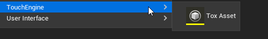

# Getting Started

# Getting started with the TouchEngine Actor

Once you installed and enabled the TouchEngine For UE plugin in your project, the easiest way to get started is by creating a new TouchEngine Actor.

To do so, go to the content browser and right-click any empty space, then click the Blueprint Class item as in the following sceenshot.

You then want to click on the "All classes" dropdown to show every additional blueprint classes you can add to your project.

Use the search menu and type `touchengine` to show the TouchEngine Actor class.

You can now click on it an this will be added to your content browser as a new actor. You should name it carefully: we suggest to prefix with `TE` or `TouchEngine` in its name as a reminder that it is a TouchEngine Actor.

You can now double click it and start to customize everything to your needs. It is already setup with a TouchEngine Component and ready for use.

This is the best and easiest path to follow and the recommended approach.

# The TouchEngine Component

## [Events](main-features.md#events) 

### The available events and what they do

- On Tox Started Loading
    - Called as soon as the TouchEngine starts loading the .tox file.
- On Tox Loaded
    - Called when the TouchEngine instance loads the .tox file. 
- On Tox Reset
    - Called when the TouchEngine instance is reset, and data is cleared.
- On Tox Failed Load
    - Called when the TouchEngine instance failed to load the .tox file.    
    - Error Message: A reason describing why the tox failed to load.
- On Tox Unloaded
    - Called when the TouchEngine instance unloads the .tox file.
    - It might be called multiple times and it is also called after On Tox Failed Load.
- On Start Frame
    - Called before sending the inputs to the TouchEngine.    
    - Frame Data: 
        * Frame Data Frame ID: The frame identifier, which is unique for this component, until it is restarted.
- On End Frame
    - Called after receiving the outputs from the TouchEngine.
    - Is Successful: True when Result is Success and the frame wasn’t dropped (Frame Data Was Frame Dropped)
    - Result: (Use a “switch” node)
        - Success
        - Inputs Discarded
        - Internal TouchEngine Error
        - Cancelled
        - Bad Request
        - Failed To Start Cook    
    - Frame Data: 
        - Frame ID: The frame identifier, which is unique for this component, until it is restarted.
        - Tick Latency: The number of ticks it took since On Start Frame was last called.
        - Latency: The number of milliseconds it took since On Start Frame was last called.
        - Was Frame Dropped: When Unreal runs faster than the TouchEngine sub process, it can happen that the frame gets dropped, although the cook happened and be successful. In that case, the Output wouldn’t have updated.
        - Frame Last Updated: The frame identifier of the last frame we received updated data from TouchEngine.
        - Cook Start Time: The internal start time of this cook returned by TouchEngine.
        - Cook End Time: The internal end time of this cook returned by TouchEngine.
- Begin Play
    - Begin Play for the Component.
    - Different from the Blueprint Begin Play, as it also fires In Editor.
    - When working in both Editor and PIE, this event should be preferred.
- End Play
    - End Play for the Component.
    - Different from the Blueprint End Play, as it also fires In Editor.
    - When working in both Editor and PIE, this event should be preferred.
- On Component Activated
    - Called when a Component has been activated, with parameter indicating if it was from a Reset.
    - Component: The Component Actor Object
    - Reset: Whether the Component Activated event triggered following a Reset.
- On Component Deactivated
    - Called when a Component has been deactivated.
    - Component: The Component Actor Object

### Adding events from the TouchEngine Component to your Blueprint

When in the blueprint editor with a TouchEngine Component, with the TouchEngine Component selected (Components pane, on the left), you will see in Details panel on the right in the list of events various events that can be used in the current blueprint and related to the TouchEngine Component.

## Inputs / outputs and parameters

Find in the details panel of your blueprint all the parameters, inputs, outputs exposed by the TouchDesigner .tox you are loading.

The list in the details panel, in the "Component Settings" drop down section will contain all parameters of the .tox you are using as well as Inputs and Outputs.

TouchEngine Inputs as well as TouchEngine Parameters can be edited in the details panel.

Hovering over the display name for each will show the identifier of the Unreal property. For Parameters, it will match the Parameter Name in Touch. For Inputs an Outputs, this should match the OP name. You need to use this identifier when you get / set Inputs / Outputs while in the blueprint editor and pass (or get) changes to (or from) the TouchEngine Component.

If you are looking for a complete sample on how to get / set every type of TouchEngine Parameters families currently supported, please have a look at the TouchEngine-UE-Sample repository.

# Tox Asset

In the content browser, users can create Tox Assets. 

Tox assets are an asset path that gets created when drag n dropping a .tox file to the content browser, or when important a .tox file following the import prompt. They can also be created “empty” for a path to be filled. The path picked will resolve itself to be absolute or relative based to the .uproject location.

Note that a Tox asset with an absolute path will not see its .tox being packaged with the project.

# Using a custom COMP in Unreal / Loading a .tox file

The file that you’ll need to be able to implement a project designed in TouchDesigner into an Unreal Engine project is a .tox file. To generate one of these from a TouchDesigner project, first open the project in TouchDesigner.

Navigate to the network containing the component you want to turn into a .tox file. Right-click on the component and select “Save Component .tox…”. Save the file inside the UE project’s “Content” folder. We usually create a new folder named "tox" or "tox files" in which we place them.

Unreal will then prompt you to import a new file. Hit import and Unreal will generate a new .uasset.

You should now see a new ToxAsset in your content browser.

You can use this new ToxAsset with a drag n drop to the details panel Tox Panel property of an existing TouchEngine Actor. An alternative is to select if from the dropdown menu of the Tox Asset property of the TouchEngine Actor.

# Adding the “TouchEngine Component” to an existing actor

Currently, the standalone TouchEngine Component (when it is not already part of a TouchEngine Actor) can only be added directly to C++ classes. In order to get the component on a Blueprint class, you'll need to derive that class from a C++ class with the component setup in it.

If you're creating a new Actor object, parent it to a C++ class with a TouchEngine Compoment added.

For adding the component to an existing Actor, you're going to need to either add a TouchEngine Component into the base C++ class **or** reparent the Blueprint. Note that reparenting can cause issues and data loss. We do not advise reparenting Pawns or Characters as they are not base Actors.

To reparent an existing blueprint actor, open the blueprint you want the component added to, select "File" at the top, and select "Reparent Blueprint".

If you don't have a C++ class with a TouchEngine Component, select "TouchEngineActor" from the dialog that pops up. This is the default Actor class with the TouchEngine Compoment attached.

Once you do this, you should see the TouchEngine Component appear in the Blueprint's "Components" panel.

All properties related to the TouchEngine Component will now also be visible in your blueprint details panel.

Note that, creating a TouchEngine Component from the content browser and adding it to an actor (through Add or by drag n drop) **doesn't** change the parent class of your Actor blueprint. This will still be an Actor blueprint with limited features compared to the TouchEngine Actor and is **not** an alternative solution to reparenting.

# Sequencer

For setting up TouchEngine variables with the Level Sequencer, add a variable corresponding to the TouchEngine variable to the Blueprint holding it, and set it with either "Get TouchEngine Input" if the variable is an input or "Get TouchEngine Output" if it's an output variable.

Make sure the variable added to the Blueprint has the values "Exposed to Cinematics" and "Instance Editiable" checked to be available in the Level Sequencer.

# Using a specific build of TouchEngine

By default, the TouchEngine build used by the Unreal Plugin will be from the most recently installed TouchDesigner on the system.

To override and use a specific build, the Unreal Plugin looks for a shortcut named “TouchEngine” when loading.

If you place any of the following, named "TouchEngine", alongside the .tox you're opening, it will use that build

- a Windows .lnk to a TouchDesigner installation
- a symlink to a TouchDesigner installation
- a full TouchDesigner installation

Lastly, you can also use the env variable `TOUCHENGINE_APP_PATH`.