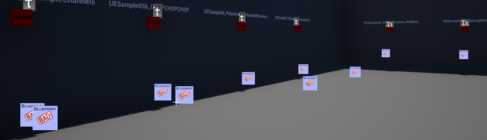

# Upgrading CHOP related blueprints from 1.1.0 to 1.2.0

CHOPs were entirely reworked in this new version of the TouchEngine for UE Plugin.

This is a breaking change.

They are now Structures. They carry more features and make them easier to work with.

At first, your project might fail to compile and they are a few tweaks that will be need in your blueprints.

Most of it should be answered here.

If you are still lost and confused after going through this doc, please drop a message on our forums or send us an email.

The complete documentation for CHOPs can be found at the following page:

[How to work with CHOPs](work-with-CHOPs.md)

# Blueprints compilation issues

When first starting your project after starting the plugin, you might encounter a few issues.

They should be easily fixed overall.

## Get / Set TouchEngine Output / Input errors

The node changed. You can just right click it and click “Refresh” for the error to disappear.

Now, keep in mind that this Value pin doesn’t output what you expect it to output anymore. But as a wildcard, it is likely still set to output the previous, now invalid type.

This is now outputting a TouchEngine CHOP Structure. It means that what happens down your blueprint flow and how you used to use this value might be impacted negatively.

You should fix the nodes that depend on that output and make sure that they receive a TouchEngine CHOP.

## Set / Get variables that were UObjects

We consider a blueprint with a variable named CHOP, of type Object.

You might have Get CHOP or Set CHOP nodes in your blueprint.

You’ll see that they are still set to UObjects.

Change your variable type to TouchEngine CHOP like in the following screenshot:

Then, click on the Set node, and hit refresh.

I can now properly set my variable CHOP to be a TouchEngine CHOP.

## Inputs of blueprints

Inputs of blueprints might be affected as well.

We consider a blueprint with an input Distances, of type Object Reference.

Similarly to the previous section, this input should be updated to be of type TouchEngine CHOP.

In my origin blueprint, I can now pass a TouchEngine CHOP.

## Is valid ?

There might be cases where you used an Is Valid node to confirm that a UObject was of a valid format to use down your blueprint.

This node is not compatible with our new CHOP type. You can instead use the “Is Valid” node of the TouchEngine section.

Note that this node can be costly and you shouldn’t abuse it.

You can assume that a CHOP is always valid when it’s outputted from the Get TouchEngine Output node.

Use the node to confirm that there is at least 1 channel or that all channels have the same number of samples.

## Num Channels, Num Samples

You can delete the previous nodes and instead use Get Num Channels or Get Num Samples.

## Getting to a channel

You might find yourself in a similar case to the following screenshot.

You can hit refresh node to partially fix the issue.

You will now need to pass a TouchEngine CHOP.

This is now getting the first channel of my TouchEngine CHOP Structure.

Alternatively, because TouchEngine CHOPs are now structures, you can split the pin by doing a right click on the pin, when it’s a TouchEngine CHOP, to work with an array of channels right away.

becomes

This is the same as using “break”:

You can then use a traditional getter instead of Get Channel to get to the channel you want to using its index.

## Pass around references, not copies

When passing data between blueprints, they are cases, often, where you want to make sure you pass a reference to your TouchEngine CHOP and not make a copy everytime you pass from blueprint to blueprint.

This is a side effect of being more flexible, the TouchEngine CHOP can have a negative impact when used in a non optimal way.

Note that overall, you should only see experience and performance improvements.

## Event cause some blueprint compilation errors

Some events have changed slightly. For instance, if you were using Get Outputs it is now On Outputs Received. Blueprints might not compile. It is easily solvable by replacing the event node by the new one.

## Passing an array of floats to a TouchEngine Input

This can be a breaking change.

When passing a 1d array straight to a CHOP with the Set TouchEngine Input node, this is now creating 1 channel of n samples rather than n channels of 1 sample. This is more efficient. You can change your CHOP network internally with a shuffle CHOP if you wish to keep the behavior as it was. 

## New features

These changes come also with new features. You should head to the [Release](https://github.com/TouchDesigner/TouchEngine-UE/releases) page of the plugin, and have a look at the 1.2.0 changelog.